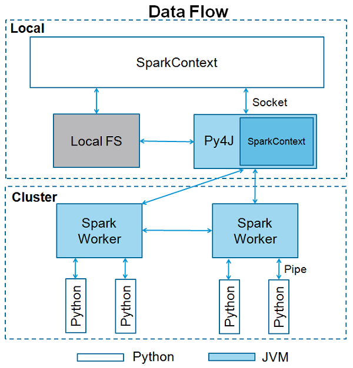

##Desafio Engenheiro de Dados

*Julio Cesar Correa - 03042020*

*Questões e respostas*

### Qual​ ​o​ ​objetivo​ ​do​ ​comando​ ​​cache​ ​​em​ ​Spark?

Força a permanencia do objeto em memória. Por default os objetos em spark são armazenados em memoria. Porem usando esse comando, voce persiste explicitamente e prioriza o objeto para se manter em cache até o fim da instancia do job ou o comando uncache.

### O​ ​mesmo​ ​código​ ​implementado​ ​em​ ​Spark​ ​é​ ​normalmente​ ​mais​ ​rápido​ ​que​ ​a​ ​implementação​ ​equivalente​ ​em MapReduce.​ ​Por​ ​quê?

Depende. na pratica pouca gente escreve codigos puros em Java para operações de map e reduce. Foram criadas outras ferramentas que abstraem essa fase. Outra coisa, Spark usa chamadas de map quando le arquivos no HDFS. 

Em minha propria experiência, operações com pequenos datasets rodavam muito mais rapido Hive do que com Spark. Mesmo usando a 2.2 . Por que? Spark usa memória e precisa levantar uma instancia do job para executar, só essa tarefa, as vezes custava mais do que executar em Hive.
O Hive faz uma interface usando codigos SQL para operar os arquivos dentro do Hadoop. Esse comando SQL é traduzido para Java que gera um JobTracker no Yarn, assim nao precisamos escrever codigos de map(filtros, group by ordenacoes) e reduce( calculo sobre os pares criados) . o JobTracker funciona com operacoes de map e reduce.

Agora na questão de performances em grandes datasets, realmente o Spark por usar o processamento in memory, deveria sobressair naturalmente sobre o MapReduce, pois toda a operacao de map e reduce é feita em arquivos em disco.

Normalmente se todos objetos cabem em memoria dá para se fazer processamentos muitos rapidos. Tive experiencia de pegar queries em Hive(mapreduce) que duravam mais de 10 horas e trazer para 2 horas usando Spark e Scala .

### Qual​ ​é​ ​a​ ​função​ ​do​ ​​SparkContext​?

Esse contexto é a representação de uma conexão com o Spark Cluster.
Quando rodamos uma aplicação em Spark, ela cria automaticamente um contexto e este reside na JVM.

### Explique​ ​com​ ​suas​ ​palavras​ ​​ ​o​ ​que​ ​é​ ​​Resilient​ ​Distributed​ ​Datasets​​ ​(RDD).

É uma coleção de objetos distribuídos e que podem ser trabalhados em paralelo. Uma outra caracteristica é que estas colecoes sao particionadas e read-only.

### GroupByKey​ ​​é​ ​menos​ ​eficiente​ ​que​ ​​reduceByKey​ ​​em​ ​grandes​ ​dataset.​ ​Por​ ​quê?

A diferença é na forma que é calculado os pares. No GroupByKey é necessário mais trafego de rede e escrita em disco,para trafegar as partições semelhantes Os dados são enviados para um unico local para ser agrupado.
No ReduceByKey,cada chave é calculada em seu proprio workera ntes de ser enviada para ser agrupada,reduzindo o trafego. 

Na pratica, ninguem usa codigo em MapReduce no dia a dia. É muito complexo e não é tão legivel. Por isso surgiram Pig, Impala e Hive. No caso até o próprio Spark passou a adotar a linguagem sql dentro dos scritps python ou scala, mais até do que os proprios comandos do spark. Hoje usa-se somente o necessário de código spark.Pois na pratica, ele processa melhor os codigos sql dentro da chamada do spark. A propria documentação reforça isso.
 

### Explique​ ​o​ ​que​ ​o​ ​código​ ​Scala​ ​abaixo​ ​faz.
 ​​​​​​​​​​​​​​​​​​​​​​​​​​​​​​​​​​
    
    val​​ ​​textFile​​ ​​=​​ ​​sc​.​textFile​(​"hdfs://..."​)
    val​​ ​​counts​​ ​​=​​ ​​textFile​.​flatMap​(​line​​ ​​=>​​ ​​line​.​split​(​"​ ​"​))
          ​​.​map​(​word​​​​=>​​​​(​word​,​​​​1​))
          ​​.​reduceByKey​(​_​​ ​​+​​ ​​_​) 
    counts​.​saveAsTextFile​(​" :hdfs://..."​)
    
1º linha : lê um arquivo que está no hdfs(filesystem do Hadoop) e armazena em um objeto chamado textFile
2º linha : 
a)separa palavras usando o espaço em branco em cada linha;
b)para cada palavra, adiciona sua quantidade, que no caso é 1 para cada palavra. 
c) agrupa por palavra que será a chave e soma a quantidade para cada palavra armazenando isso no objeto "counts".
3º Salva o conteúdo calculado , o processamento novamente no hdfs em formato texto.

    
    
   