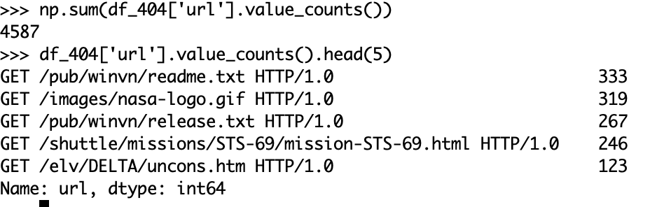

## HTTP​ ​requests​ ​to​ ​the​ ​NASA​ ​Kennedy​ ​Space​ ​Center​ ​WWW​ ​server

Fonte​ ​oficial​ ​do​ ​dateset​:​ ​​http://ita.ee.lbl.gov/html/contrib/NASA-HTTP.html 

Dados​:

Arquivo 1 --> ftp://ita.ee.lbl.gov/traces/NASA_access_log_Jul95.gz (Jul​ ​01​ ​to​ ​Jul​ ​31,​ ​ASCII​ ​format,​ ​20.7​ ​MB​ ​gzip​ ​compressed​,​ ​205.2​ ​MB)

Arquivo 2 --> ftp://ita.ee.lbl.gov/traces/NASA_access_log_Aug95.gz (Aug​ ​04​ ​to​ ​Aug​ ​31,​ ​ASCII​ ​format,​ ​21.8​ ​MB​ ​gzip​ ​compressed​,​ ​167.8​ ​MB.)

### Sobre o dataset​
Esses dois conjuntos de dados possuem todas as requisições HTTP para o servidor da NASA Kennedy Space​ ​Center​ ​WW	W​ ​na​ ​Flórida​ ​para​ ​um​ ​período​ ​específico.

Os​ ​logs​ ​estão​ ​em​ ​arquivos​ ​ASCII​ ​com​ ​uma​ ​linha​ ​por​ ​requisição​ ​com​ ​as​ ​seguintes​ ​colunas:

● Host fazendo a requisição​. Um hostname quando possível, caso contrário o endereço de internet se o nome não​ ​puder​ ​ser​ ​identificado.

● Timestamp​ ​​no​ ​formato​ ​"DIA/MÊS/ANO:HH:MM:SS​ ​TIMEZONE"

● Requisição​ ​(entre​ ​aspas)

● Código​ ​do​ ​retorno​ ​HTTP

● Total​ ​de​ ​bytes​ ​retornados

### Questões

​***​Responda​ ​as​ ​seguintes​ ​questões​ ​devem​ ​ser​ ​desenvolvidas​ ​em​ ​Spark​ ​utilizando​ ​a​ ​sua​ ​linguagem​ ​de​ ​preferência.​***
​

1. Número​ ​de​ ​hosts​ ​únicos.
 
` R: 42.141`

2. O​ ​total​ ​de​ ​erros​ ​404.

` R: 4.587`

3. Os​ ​5​ ​URLs​ ​que​ ​mais​ ​causaram​ ​erro​ ​404.

 R: `df_404['url'].value_counts().head(5)`
 
 
 Imagem abaixo, mostra a saída:
 
 

4. Quantidade​ ​de​ ​erros​ ​404​ ​por​ ​dia.

 R: O codigo em pythom/pandas usado foi `df_404_1.groupby('day').count() `

5. O​ ​total​ ​de​ ​bytes​ ​retornados.

` R: 12.851.849.323 ou 11.9GB.`

